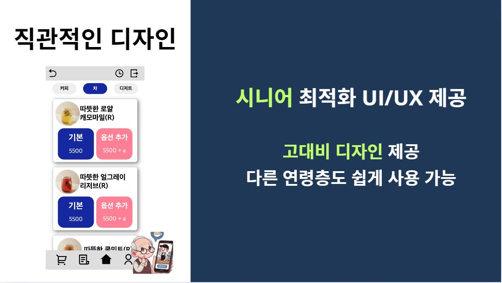
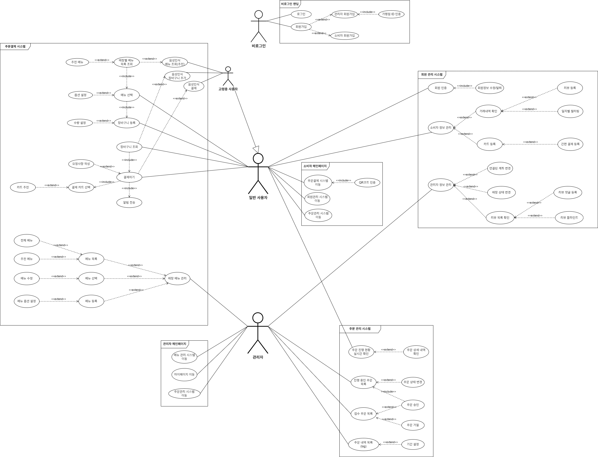
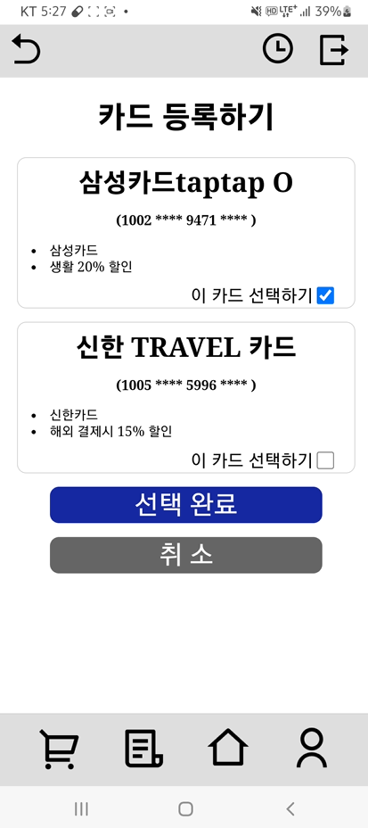
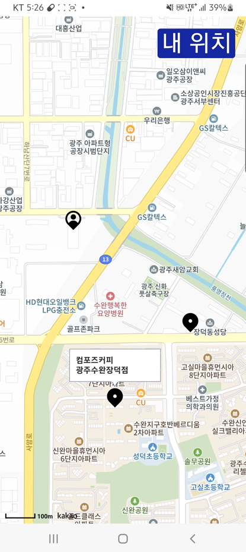

# Silver Order
 내 손 안의  시니어 키오스크
***

  ### 1. 프로젝트 제목
  Silver Order

  ### 2. 로고 및 이미지 

  ### 3. 프로젝트 정보 🗂

  `개발기간: 2024.08.26 ~ 2024.10.11 (7주)`

  ### 4. 배포 주소 🌐

  백엔드 서버: 'https://j11c202.p.ssafy.io/silverorder/api/'

## 프로젝트 소개 

   

  현대 사회에서 키오스크의 도입이 늘어나고 있지만, 시니어층이 이를 사용하는 데 어려움을 겪는 경우가 많습니다. Silver Order는 이러한 문제를 해결하기 위해 설계된 시니어 친화형 주문 시스템입니다.

  ### 주요 기능
  #### 1. 음성 주문 지원
  시니어 사용자들이 복잡한 메뉴를 터치하지 않아도, 음성 명령만으로 쉽게 주문할 수 있습니다.

  #### 2. 혜택 카드 추천
  사용자의 주문 내역에 기반하여 가장 적합하고 혜택이 많은 카드를 자동으로 추천해줍니다.

  #### 3. 고대비 디자인
  시각적인 불편함을 최소화하기 위해 고대비 컬러와 직관적인 UI/UX를 적용해 누구나 쉽게 사용할 수 있습니다.

   
   
   

  
  
  
  
  
  
  
  
  
  
  
  

## 주요기능 🔍

  <h3>📌 AI를 활용한 음성 주문 분석 및 메뉴 추천</h3>
  <ul style="text-align: center;">
    <li>STT, TTS를 활용한 음성인식 주문</li>
    <li>BERT모델, LLM, RAG를 활용한 음성 주문 분석 및 메뉴 추천 기능</li>
  </ul>

  <h3>📌 혜택이 좋은 카드 자동 추천 </h3>
  <ul style="text-align: center;">
    <li>SSAFY 금융망 API을 활용한 간편(추천) 결제 시스템 구축</li>
  </ul>

  <h3>📌 직관적인 디자인</h3>
  <ul style="text-align: center;">
    <li>보기 편한 큰 글씨와 버튼</li>
    <li>명확한 색상 대비</li>
    <li>복잡하지 않고 깔끔한 디자인</li>
  </ul>

  <h3>📌 소켓 통신을 통한 주문 상태 실시간 확인</h3>
  <ul style="text-align: center;">
    <li>사용자가 주문을 하면 매장 페이지에 알림 전송</li>
    <li>주문 승인이 되면 사용자는 주문 실시간 상황을 확인 가능</li>
  </ul>

## 기술 스택 📖

  ### Frontend

  
  
  

  ### Infrastructure

  
  
  
  

  ### AI

  

  ### Backend

  
  
  
  

  ### DB

  

  

## Figma Mockup

https://www.figma.com/design/owlRaOIHd9WRoKhJDBLIQo/2%ED%95%99%EA%B8%B0-%ED%8A%B9%ED%99%94-PJT-%EB%AA%A9%EC%97%85?node-id=0-1&t=9rVjtzQUovhIRSmF-1

## 아키텍쳐 📑

## ERD 

## Use Case Diagram

## 요구 사항 명세서

## 사용자 App

### 사용자 App 📱 메인 페이지

### AI 음성 주문 페이지

### 주문 페이지

### 결제 관련

### 지도 화면

## 매장 페이지

### 로그인 회원 가입 페이지
  
  
  ### 매장 Dashboard
  

  ### 주문 페이지
  
  
  

  ### 메뉴 페이지
  

  ### 리뷰 페이지
  

## 팀 소개 👨‍👨‍👦 
  

<table>
  <tbody>
    <tr>
      <td align="center">
        채기훈
         
        <b></b>
      </td>
      <td align="center">
        노명환
         
        <b></b>
      </td>
      <td align="center">
        박봉균
         
        <b></b>
      </td>
    </tr>
    <tr>
      <td>
        <ul>
          <li><strong>SSAFY 11th </strong></li>
          <li>Backend</li>
          <li>Infra</li>
        </ul>
      </td>
      <td>
        <ul>
          <li><strong>SSAFY 11th</strong></li>
          <li>Backend</li>
        </ul>
      </td>
      <td>
        <ul>
          <li><strong>SSAFY 11th</strong></li>
          <li>Backend</li>
          <li>AI</li>
        </ul>
      </td>
    </tr>
    <tr>
      <td align="center">
        천요성
         
        <b></b>
      </td>
      <td align="center">
        박동민
         
        <b></b>
      </td>
    </tr>
    <tr>
      <td>
        <ul>
          <li><strong>SSAFY 11th</strong></li>
          <li>FE</li>
          <li>매장 페이지</li>
        </ul>
      </td>
      <td>
        <ul>
          <li><strong>SSAFY 11th</strong></li>
          <li>FE</li>
          <li>사용자 앱 페이지</li>
        </ul>
      </td>
    </tr>
  </tbody>
</table>

